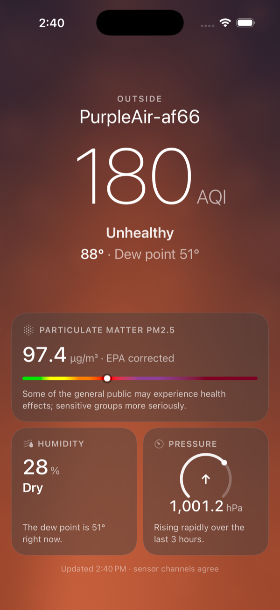
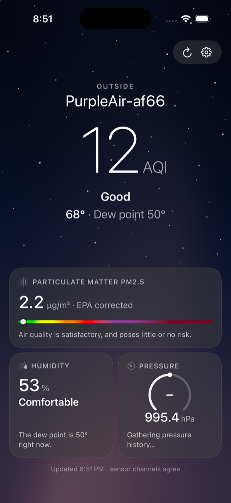
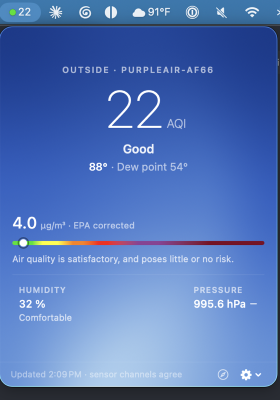

# PurpleAir LAN

Native apps for monitoring a PurpleAir sensor **on your own network** — no cloud, no
API keys, no internet required. An iOS "living wallpaper" dashboard and an
ultra-low-power macOS menu bar widget, sharing one Swift core.

| iOS — smoke event | iOS — clean night | macOS — PurpleAir Bar |
|:---:|:---:|:---:|
|  |  |  |

## The apps

### PurpleAir LAN (iOS)

A full-screen ambient dashboard in the iOS Weather app's design language — the
wallpaper *is* the metric:

- The animated background palette follows the six EPA AQI bands (serene blue →
  golden haze → amber → smoky brown → maroon → oxblood), blended day/night by a
  solar model driven by the sensor's own coordinates, with twilight warmth at the
  horizon. Haze motes thicken with PM2.5; stars come out on clean nights.
- Hero AQI numeral + category, temperature · dew point line, and frosted glass
  cards: PM2.5 with the official EPA color scale bar and health guidance, humidity
  with comfort band, pressure with a persisted 3-hour trend.
- Ambient behavior: the screen stays awake, chrome fades after 5 s idle and
  returns on tap, data refreshes every 30 s with smooth numeric transitions.

### PurpleAir Bar (macOS 15+)

A polite menu bar housemate. When your Mac can reach the sensor it shows an
EPA-colored dot and the AQI (`● 22`); click it for a 340 pt miniature of the living
wallpaper. When the sensor is unreachable it fades to a dim ghost glyph and goes
quiet.

- **Near-zero footprint by design:** one coalesced ~2 KB LAN fetch per minute while
  home (`NSBackgroundActivityScheduler`, `.utility` QoS), network-change-triggered
  probing with exponential backoff (capped at 5 min) while away, zero scheduled
  work while asleep or off-network, and no rendering while the panel is closed.
  Measured: 0.0 % CPU at idle.
- Footer controls: launch at login, change sensor address inline, open the
  sensor's own web page, quit.

## Honest numbers

Both apps correct the sensor's known biases instead of displaying raw values:

- **AQI** is computed in-app: A/B laser channel mean → EPA/Barkjohn correction →
  the **May 2024** EPA PM2.5 breakpoints (Good is 0–9.0 µg/m³ now). The firmware's
  own AQI field predates that revision and is never shown. A footer notes when the
  two laser channels disagree (EPA QC rule).
- **Temperature** −8 °F and **humidity** +4 % (documented board self-heating
  biases); **dew point** recomputed from the corrected pair via the Magnus formula.
- EPA category colors are the official AirNow values, and color is never the only
  signal — the numeral and category word always accompany it.

## Repo structure

```
purpleair-lan/
├── PurpleAir.xcworkspace        # open this — both apps + the package
├── PurpleAirKit/                # shared SwiftPM package (iOS 18 / macOS 15)
│   ├── Sources/PurpleAirKit/    #   EPA pipeline, models, palettes, solar model,
│   │                            #   scene view, scale bar, reachability policy
│   └── Tests/PurpleAirKitTests/ #   53 unit tests — run with `swift test`
├── PurpleAir LAN/               # iOS app (views only; core comes from the kit)
├── PurpleAir LAN.xcodeproj
├── PurpleAirBar/                # macOS menu bar app
├── PurpleAirBar.xcodeproj
└── docs/                        # design specs, plans, screenshots
```

## Building

Requirements: Xcode 26, a PurpleAir sensor on your LAN.

```bash
git clone https://github.com/shrisha/purpleair-lan.git
cd purpleair-lan
open PurpleAir.xcworkspace
```

- **iOS**: select the *PurpleAir LAN* scheme → run on device/simulator. On first
  launch enter the sensor's hostname or IP (e.g. `purpleair.lan` or
  `192.168.1.100` — no `http://` needed), test, save.
- **macOS**: select the *PurpleAir Bar* scheme → run. The widget appears in the
  menu bar (no Dock icon); set the sensor address from the gear menu if the
  default `purpleair.lan` doesn't resolve on your network. Enable *Launch at
  Login* from the same menu.
- **Core tests**: `cd PurpleAirKit && swift test` — no simulator needed.

## How it talks to the sensor

Plain local HTTP, the sensor's own JSON endpoint:

```
http://<sensor-hostname-or-ip>/json     # firmware's 2-minute average
```

Finding the address: check your router's client list for a device named
`PurpleAir-xxxx`. Some routers register it in local DNS (that's why
`purpleair.lan` works); otherwise use the IP. Sensors don't advertise over
Bonjour, so the address is the one thing you configure.

## Troubleshooting

- **"Cannot find sensor at this address"** — confirm the device is on the same
  Wi-Fi as the sensor and the address is right; watch out for router AP/client
  isolation, which blocks device-to-device traffic.
- **Menu bar shows the ghost icon at home** — open the panel (that kicks an
  immediate probe) or check the address in the gear menu.
- **Pressure card says "Gathering pressure history…"** — expected: the 3-hour
  trend needs ~2 hours of samples before it can show rising/falling.

## Privacy

Local network only. Nothing leaves your LAN, no analytics, no accounts; the only
thing stored is the sensor address (and a few hours of pressure samples for the
trend), on-device.
